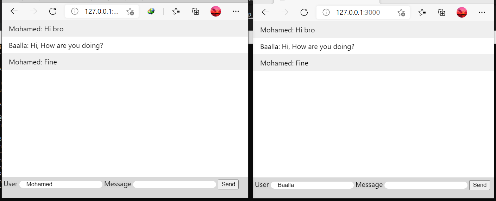

# Simple Live Chat with NodeJs / Express / Socket.io

Looks like this:

In order to setup the app, please run this steps:

## Running the App:

1. Download this repo.
2. npm install
3. npm start
4. Now, you will have all the necessaries to run your App, in my case the local url is like this: http://127.0.0.1:3000/"# Simple-Live-Chat-with-NodeJs-Express-Socket.io" 
